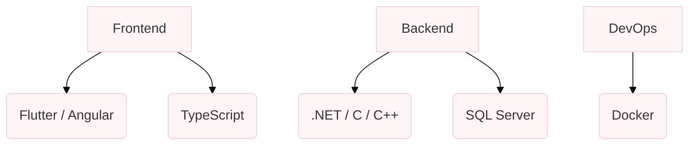

# Hi there, I'm Amina

### *Software Engineer*

## Profile

I am a Software Engineering graduate with a passion for building end-to-end solutions, from web dashboards and mobile apps to hardware-integrated IoT systems. Experienced across full-stack development and machine learning, utilizing Python, .NET, JavaScript, and Flutter. Dedicated to writing clean, functional code that solves real-world problems.

* **Core Focus:** Internet Things, Embedded Systems engineering, Full-stack development.
* **Current Pursuit:** Embedded Systems and Electrical Engineering

## Technical Ecosystem

 

